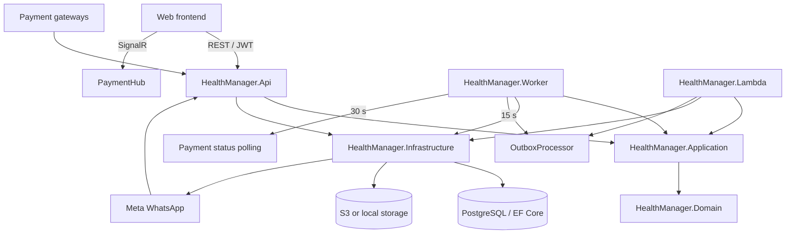
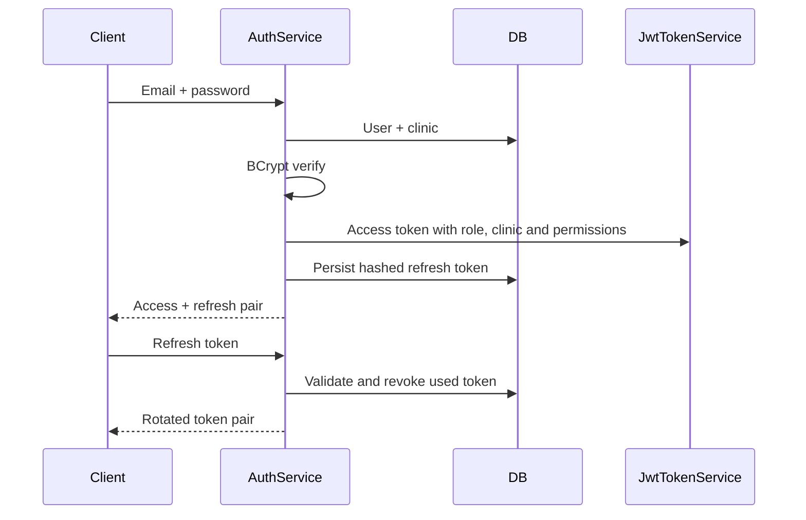
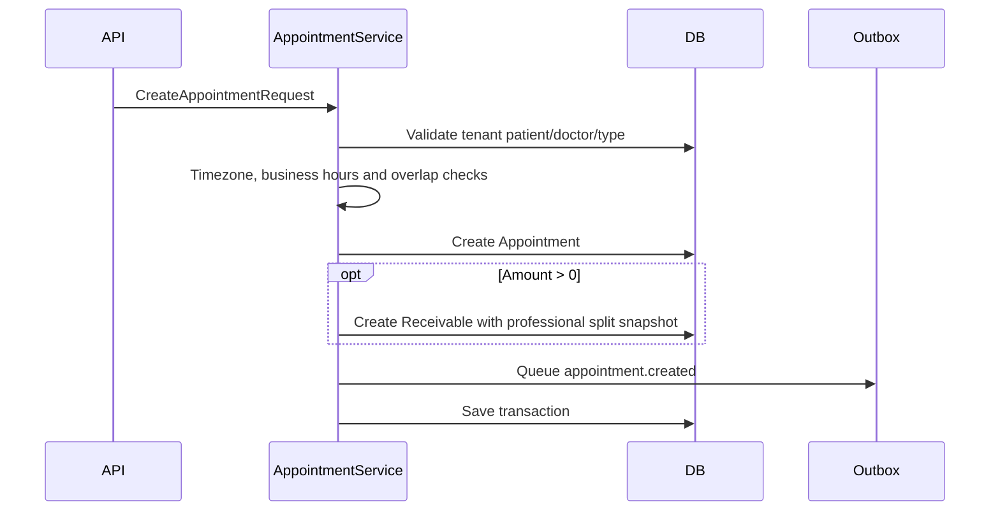
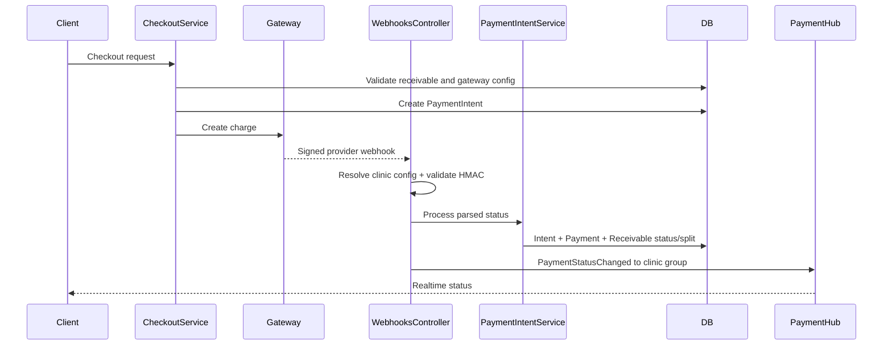
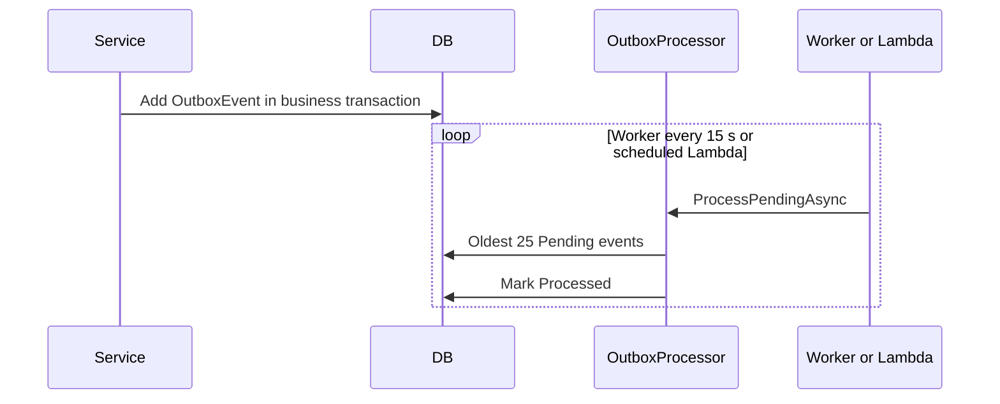
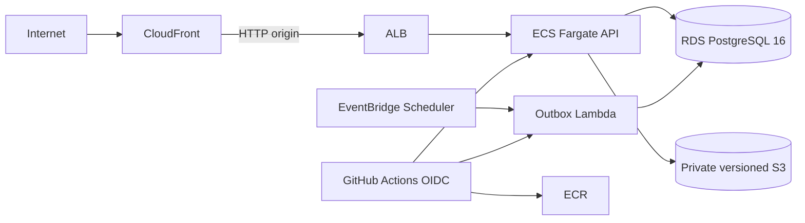

# Codebase Map

> Auto-generated by Cartographer. Last mapped: 2026-09-21T17:04:15Z
>
> Token count is an estimate based on tracked text-file sizes. EF migration designers account for most of the repository volume.

## System Overview

HealthManager is a .NET 10 modular monolith for a multi-tenant Brazilian medical CRM. The HTTP API, background worker, and AWS Lambda share the same Application, Domain, and Infrastructure projects. PostgreSQL is the production database; integration tests replace it with EF Core InMemory.



The dependency direction is:

```text
Api / Worker / Lambda -> Application -> Domain
Api / Worker / Lambda -> Infrastructure -> Application + Domain
```

`Application` owns use cases and boundary interfaces, but it references EF Core through `IApplicationDbContext`; it is not persistence-framework independent.

## Directory Structure

```text
HealthManager/
├── spec/                           Canonical entities, state machines, rules, auth and routes
├── src/
│   ├── HealthManager.Domain/       Entities, enums and permission matrix
│   ├── HealthManager.Application/  DTOs, use cases and infrastructure boundaries
│   ├── HealthManager.Infrastructure/ EF Core, JWT, storage, Meta API and outbox
│   ├── HealthManager.Api/          ASP.NET Core controllers, middleware and SignalR
│   ├── HealthManager.Worker/       Outbox and payment-status background loops
│   └── HealthManager.Lambda/       AWS custom-runtime outbox entry point
├── tests/HealthManager.Tests/      Unit/service and HTTP integration tests
├── docs/                           OpenAPI contract and operational documentation
├── infra/                          Terraform for AWS and bootstrap state resources
├── .github/workflows/              CI, coverage and AWS deployment
├── Dockerfile.api                  API container
├── Dockerfile.worker               Worker container
├── docker-compose.yml              PostgreSQL + API + Worker local stack
├── Directory.Build.props           Shared net10.0 project settings
├── global.json                     .NET SDK pin
└── HealthManager.sln               Seven-project solution
```

## Module Guide

### Domain

**Purpose**: Defines all persistent entities, enums, base classes, and finance permission constants.

**Entry point**: `src/HealthManager.Domain/Model.cs`

| File | Purpose | Est. tokens |
|---|---|---:|
| `src/HealthManager.Domain/Model.cs` | `Entity`, `TenantEntity`, 32 domain entities, enums and `Permissions.ForRole` | 4,708 |
| `src/HealthManager.Domain/HealthManager.Domain.csproj` | Dependency-free class library | 24 |

Main areas:

| Area | Entities |
|---|---|
| Tenant and identity | `Clinic`, `User`, `RefreshToken`, `AuditLog` |
| Patients | `Patient`, `PatientDocument`, `HealthInsurance` |
| Scheduling | `Doctor`, `Specialty`, `DoctorSpecialty`, `DoctorAvailability`, `AppointmentType`, `Appointment` |
| Finance | `Receivable`, `Payment`, `Expense`, `ExpenseCategory`, `PaymentIntent` |
| Catalog and applications | `Product`, `Package`, `PackageItem`, `PatientProductBalance`, `PatientApplication` |
| Clinical | `ClinicalRecord`, `ClinicalRecordAddendum` |
| Messaging and integrations | `WhatsAppMessage`, `WebhookEvent`, `OutboxEvent`, four clinic integration configuration entities |

`Entity` supplies IDs and audit/soft-delete timestamps. `TenantEntity` adds nullable `ClinicId`; several clinic configuration types inherit `Entity` and receive explicit EF filters instead.

### Application

**Purpose**: Contains request/response contracts, concrete use cases, validation performed beyond MVC, and boundaries implemented by Infrastructure.

**Entry point**: `src/HealthManager.Application/DependencyInjection.cs` via `AddApplication()`.

| File | Purpose | Est. tokens |
|---|---|---:|
| `src/HealthManager.Application/Abstractions.cs` | Tenant, database, storage, password, JWT and outbox boundaries | 695 |
| `src/HealthManager.Application/Contracts.cs` | Public DTOs, filters and DataAnnotations | 5,003 |
| `src/HealthManager.Application/Services.cs` | All main use cases and business orchestration | 39,575 |
| `src/HealthManager.Application/DependencyInjection.cs` | Registers 24 scoped services and payment components | 509 |
| `src/HealthManager.Application/PaymentGateway/*` | Gateway client contract, HMAC parsers and provider handlers | — |
| `src/HealthManager.Application/IMetaCloudApiClient.cs` | WhatsApp delivery boundary | — |

Important service groups:

| Group | Services |
|---|---|
| Identity/tenant | `AuthService`, `ClinicProvisioningService`, `TenantSettingsService`, `TenantIntegrationService` |
| Patient/clinical | `PatientService`, `PatientPortalService`, `ClinicalRecordService`, `PatientApplicationService` |
| Scheduling/catalog | `DoctorService`, `AppointmentService`, `AppointmentTypeService`, `HealthInsuranceService`, `SpecialtyService`, `DoctorAvailabilityService`, `ProductService`, `PackageService` |
| Finance/payments | `FinancialService`, `ExpenseService`, `ExpenseCategoryService`, `PaymentIntentService`, `CheckoutService`, `DashboardService` |
| Messaging | `WhatsAppWebhookService`, `WhatsAppMessagingService`, `WhatsAppAtendimentoService` |

`AddApplication()` currently registers `MockPaymentGatewayClient` as the global `IPaymentGatewayClient`. Provider-specific Asaas, Mercado Pago, and Stripe handlers validate and parse webhooks but do not replace that outbound client.

### API

**Purpose**: ASP.NET Core composition root exposing REST, health checks, Swagger in Development, and a payment SignalR hub.

**Entry point**: `src/HealthManager.Api/Program.cs`

| File | Purpose | Est. tokens |
|---|---|---:|
| `src/HealthManager.Api/Program.cs` | Host setup, middleware, DI, CORS, auth and exception mapping | 815 |
| `src/HealthManager.Api/Controllers/*.cs` | 25 controllers and 105 actions | — |
| `src/HealthManager.Api/Hubs/PaymentHub.cs` | Clinic-scoped `PaymentStatusChanged` groups | — |
| `src/HealthManager.Api/HealthManager.Api.http` | Manual smoke requests; partially stale | — |

There is no global `/api` prefix or API versioning. Major route groups are:

| Area | Routes | Authorization |
|---|---|---|
| Auth/provisioning | `/auth/*`, `/internal/clinics/*` | Anonymous/JWT or `PlatformAdminOnly` |
| Patients/portal | `/patients/*`, `/portal/*` | `ClinicStaff`, Admin/Secretary, Doctor, or `PatientPortal` by action |
| Scheduling | `/doctors`, `/appointments`, `/appointment-types`, availability and catalog routes | Clinic role policies |
| Clinical records | `/appointments/{id}/clinical-record*` | Staff read; Doctor write/finalize/addendum |
| Finance | `/financial/*`, `/expense-categories` | Granular `permission` claims |
| Checkout | `/payment-intents`, `/checkout`, `/portal/checkout` | Clinic staff/admin or patient portal |
| Integrations | `/tenant/integration/*`, `/whatsapp/*`, `/webhooks/payments/*` | Admin/staff or anonymous webhook validation |
| Realtime | `/hubs/payments` | `ClinicStaff` |

The global exception handler maps validation/domain-style exceptions to 400/401/404/409 and returns `ProblemDetails`. Unknown exceptions map to 500.

### Infrastructure

**Purpose**: Implements persistence, tenant resolution, JWT, BCrypt, storage, Meta delivery, outbox processing, and database initialization.

**Entry point**: `src/HealthManager.Infrastructure/DependencyInjection.cs` via `AddInfrastructure()`.

| File | Purpose | Est. tokens |
|---|---|---:|
| `src/HealthManager.Infrastructure/DependencyInjection.cs` | Provider selection, auth policies and technical DI | 1,515 |
| `src/HealthManager.Infrastructure/Services.cs` | Tenant/JWT/storage/password/outbox implementations | 2,217 |
| `src/HealthManager.Infrastructure/Persistence/AppDbContext.cs` | EF model, relationships, indexes and global filters | 4,489 |
| `src/HealthManager.Infrastructure/Persistence/AppDbInitializer.cs` | Migrate/EnsureCreated and deterministic seed | 2,336 |
| `src/HealthManager.Infrastructure/Integrations/MetaCloudApiClient.cs` | Meta Graph API v21 client | — |
| `src/HealthManager.Infrastructure/Persistence/Migrations/*` | 22 schema migrations, designers and current snapshot | ~271,171 total |

PostgreSQL is selected by default; `USE_INMEMORY_DATABASE=true` selects EF InMemory. Global query filters combine soft deletion with clinic isolation. PlatformAdmin bypasses clinic filtering. `OutboxEvent` is intentionally cross-tenant for processing.

Database initialization happens in the API before serving traffic. Relational providers run migrations; InMemory uses `EnsureCreatedAsync`. An empty database receives fixed demo seed IDs and credentials.

### Worker and Lambda

| Project/file | Purpose |
|---|---|
| `src/HealthManager.Worker/Program.cs` | Generic Host composing Application and Infrastructure |
| `src/HealthManager.Worker/OutboxWorker.cs` | Processes up to 25 pending events every 15 seconds |
| `src/HealthManager.Worker/PaymentStatusWorker.cs` | Polls up to 25 active payment intents every 30 seconds |
| `src/HealthManager.Lambda/Function.cs` | Builds DI once and processes one outbox batch per invocation |
| `src/HealthManager.Lambda/HealthManager.Lambda.csproj` | Custom runtime `bootstrap`, self-contained deploy, invariant globalization |

The Worker does not run migrations. The Lambda is the production outbox processor and is scheduled once per minute. The current AWS topology does not deploy the payment-status Worker.

### Tests

**Purpose**: Exercise HTTP endpoints with `WebApplicationFactory` plus focused service/controller behavior.

| File/group | Purpose | Est. tokens |
|---|---|---:|
| `tests/HealthManager.Tests/Integration/ApiTestFactory.cs` | Per-test host, random InMemory DB, seed, login and DB helpers | 1,162 |
| `tests/HealthManager.Tests/Integration/*Tests.cs` | 17 endpoint test classes | ~24,046 total |
| `tests/HealthManager.Tests/TestHelpers.cs` | Fresh standalone InMemory contexts | — |
| `tests/HealthManager.Tests/TestDoubles.cs` | Fake tenant, storage and Meta client | — |
| `tests/HealthManager.Tests/*Tests.cs` | Eight focused service/controller test classes | ~7,150 total |

Current suite shape: 25 classes and approximately 97 xUnit cases. Integration tests cover auth, tenant isolation, patients, doctors, appointments, clinical records, finance permissions, checkout/intents/webhooks, integrations, WhatsApp, catalogs, and patient applications. Dedicated integration coverage is absent for dashboard, the patient portal as a whole, health-insurance/specialty/availability CRUD, health check, SignalR, and Meta verification GET.

### Specifications and contracts

The workflow is spec-first. These files are canonical before code changes:

| File | Purpose | Est. tokens |
|---|---|---:|
| `spec/entities.yaml` | 32 entity definitions and constraints | 2,995 |
| `spec/state-machines.yaml` | Appointment, Receivable, Confirmation, ClinicalRecord and PaymentIntent transitions | 920 |
| `spec/business-rules.yaml` | Tenant, auth, finance, scheduling, documents, gateways and outbox rules | 3,798 |
| `spec/auth-flow.yaml` | User and patient authentication flows and JWT shape | 739 |
| `spec/api-endpoints.yaml` | Canonical route/policy/request-response catalogue | 3,522 |
| `docs/openapi.json` | Frontend client-generation contract | 30,972 |

`docs/openapi.json` currently has 60 paths and 81 operations, while the canonical endpoint spec describes 106 operations. Known missing or inconsistent areas include several catalog/expense/internal routes, health, WhatsApp webhook routes, doctor update verb, document upload, and the absent `bearerAuth` security-scheme definition.

## Data Flow

### Authenticated request and tenant isolation

```mermaid
sequenceDiagram
    participant Client
    participant API
    participant Tenant as RequestTenantProvider
    participant Service as Application service
    participant EF as AppDbContext
    participant DB as PostgreSQL

    Client->>API: JWT + request
    API->>API: Role/permission policy + model binding
    API->>Tenant: Resolve user, role and clinic
    Note over Tenant: code uses clinic_id first; canonical spec requires X-Clinic-Id first
    API->>Service: Validated DTO
    Service->>EF: Query/mutate
    EF->>DB: Tenant + soft-delete filtered SQL
    DB-->>EF: Data
    EF-->>Service: Entities
    Service-->>API: Response DTO
    API-->>Client: JSON (enums as strings)
```

### Login and refresh rotation



### Appointment creation



### Checkout, gateway callback, and realtime update



### Outbox execution



The current processor marks events processed but does not dispatch them to external handlers.

## Deployment Topology



Terraform modules under `infra/modules/` own network, database, storage, and compute. CI builds/tests on `master`, `main`, `develop`, and PRs; only `master`/`main` pushes deploy. ECS runs the API only. Lambda uses `provided.al2023`; EventBridge invokes it every minute.

## Configuration

| Key | Consumer/purpose |
|---|---|
| `DATABASE_URL` | PostgreSQL connection; falls back to configured/default connection string |
| `USE_INMEMORY_DATABASE`, `INMEMORY_DATABASE_NAME` | Test/local provider selection |
| `JWT_SECRET`, `JWT_ISSUER`, `JWT_AUDIENCE` | JWT signing and validation |
| `JWT_ACCESS_TOKEN_MINUTES`, `JWT_REFRESH_TOKEN_DAYS` | Token lifetimes |
| `AWS_S3_BUCKET`, `LOCAL_STORAGE_ROOT` | S3 or local document storage |
| `CORS_ORIGINS` | Credentialed API origins |
| `WHATSAPP_VERIFY_TOKEN` | Meta webhook verification GET |
| `VIACEP_BASE_URL` | CEP lookup endpoint |
| `SENTRY_DSN` | Optional API Sentry integration |
| `ASPNETCORE_ENVIRONMENT`, `DOTNET_ENVIRONMENT` | Runtime profiles |

Local API launch profiles use ports 5142/7022; containers expose port 8080.

## Conventions

- Update `spec/` before changing entities, state transitions, rules, auth, or routes.
- Use sealed record DTOs with DataAnnotations and sealed mutable entity classes.
- Controllers use primary constructors and concrete Application services.
- Queries commonly use `AsNoTracking`; mutations are tracked and saved once.
- Use `decimal` for money, `DateTimeOffset` for timestamps, and `DateOnly` for date filters.
- HTTP and SignalR serialize enums as strings.
- Soft delete is explicit via `DeletedAt`; EF does not rewrite `Delete` calls automatically.
- Tenant protection is duplicated intentionally: service guards plus EF global filters.
- Services are registered as concrete scoped classes; technical capabilities use boundary interfaces.
- Any entity change requires an EF migration and `has-pending-model-changes` verification.
- Request/response changes require `docs/openapi.json` updates and frontend client regeneration.

## Gotchas

### Security and tenancy

- `RequestTenantProvider` resolves `clinic_id` from JWT before `X-Clinic-Id`, but `spec/business-rules.yaml` requires the reverse order. This tenant-isolation mismatch needs a deliberate code fix with cross-tenant tests; do not silently treat the implementation as canonical.
- A null tenant in EF filters is fail-open and can expose all clinics; background processes rely on this behavior.
- The anonymous WhatsApp POST webhook does not validate a Meta signature and trusts the clinic ID in its simplified body.
- Payment webhooks validate HMAC but do not verify that the route provider matches the clinic's configured provider.
- Integration secrets are stored as ordinary entity properties; encryption at rest is specified but not visible in these layers.
- Login, portal auth, and webhook endpoints have no rate limiting.
- Unknown 500 responses include `exception.Message`.

### Runtime behavior

- `MockPaymentGatewayClient` is registered unconditionally and confirms polled intents.
- Production deploys the outbox Lambda but not `PaymentStatusWorker`.
- The outbox processor only marks events processed; it has no external dispatch, claim lock, or persisted failure path.
- Patient application concurrency uses an in-process static `SemaphoreSlim`; it is not cross-instance locking.
- Doctor users are created with a fixed initial password literal; Doctor-to-User ownership is matched by email, not FK.
- API startup applies migrations and seeds any database with no users, including Production.
- Worker and Lambda assume the API already migrated the database.
- Local storage resolution may fail because `StorageService` requires `IAmazonS3` while S3 is conditionally registered.

### Infrastructure and operations

- Lambda runs in private subnets without NAT or VPC endpoints; future internet/S3 calls need network changes.
- HTTPS terminates at CloudFront; the public ALB origin remains reachable over HTTP.
- Terraform bootstrap state and `lambda-placeholder.zip` are tracked artifacts.
- The root backend uses S3 lockfiles rather than the DynamoDB lock table created by bootstrap.
- The GitHub deploy policy still references a worker ECR repository that the current Terraform/workflow does not deploy.

### Contracts and tests

- `docs/openapi.json`, `HealthManager.Api.http`, `docs/local-smoke-test.md`, `README.md`, and the old roadmap contain known stale pieces; `spec/` is authoritative.
- DataAnnotations run automatically only through MVC; internal service calls must enforce their own invariants.
- EF InMemory does not reproduce PostgreSQL constraints, transactions, row locking, or provider-specific SQL.
- Several significant surfaces lack dedicated integration tests, especially portal, dashboard, SignalR, and some catalogs.
- Some spec statements disagree internally: appointment cancellation graph vs “any”, webhook signature headers, and the old manual-receivable route name.

## Navigation Guide

| Task | Start here | Then update/verify |
|---|---|---|
| Add or change an entity | `spec/entities.yaml` | Domain model → `AppDbContext` → migration → snapshot check → tests |
| Change a state transition | `spec/state-machines.yaml` | Application service → controller → focused and integration tests |
| Add/change an API route | `spec/api-endpoints.yaml` | Contract DTO → service → controller → `docs/openapi.json` → frontend client |
| Change a business rule | `spec/business-rules.yaml` | Owning Application service → relevant endpoint/service tests |
| Change user authentication | `spec/auth-flow.yaml` | `AuthService` → `JwtTokenService` → policies → auth tests |
| Change finance access | `finance_screens` in business rules | `Permissions.ForRole` → policy registration → `FinancialPermissionsTests` |
| Change tenant filtering | `ITenantProvider` + `RequestTenantProvider` | `AppDbContext` filters → cross-tenant integration tests |
| Add a catalog module | Existing Product/Package pattern | DTO/service/controller → DI → spec/OpenAPI → migration/tests |
| Change clinical records | Clinical specs/state machine | `ClinicalRecordService` → controller → ownership/finalization tests |
| Change checkout/gateways | Payment intent specs/rules | gateway handlers/client → webhook → checkout/intents/webhook tests |
| Change WhatsApp behavior | WhatsApp rules | messaging/webhook services → Meta client → webhook/atendimento tests |
| Change document storage | Document rules | `IStorageService`/`StorageService` → patient service/controller → fake-storage tests |
| Change background processing | Outbox/payment workers | Worker and Lambda hosts → deploy topology → operational tests |
| Change AWS resources | `infra/main.tf` | Relevant module → workflow assumptions → `terraform plan` |
| Run manually | `src/HealthManager.Api/HealthManager.Api.http` | Correct its known stale requests first |

## Toolchain

- SDK: .NET `10.0.301` (`rollForward: latestMajor`), target framework `net10.0`.
- Local tools: `dotnet-ef` 10.0.9 and ReportGenerator 5.5.10.
- Tests: xUnit, FluentAssertions, `Microsoft.AspNetCore.Mvc.Testing`, EF Core InMemory, coverlet.
- Restore local tools before EF or coverage report commands: `dotnet tool restore`.
- The frontend is a sibling repository at `..\healthmanager-web`.
